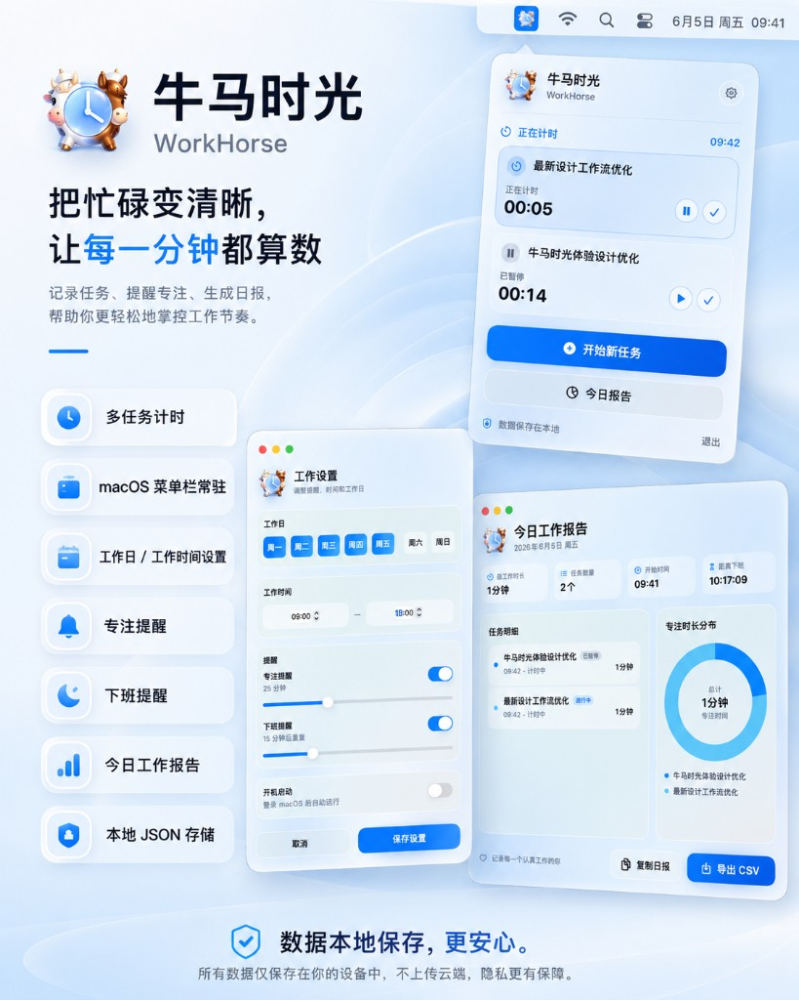

<p align="center">
  
</p>

# 牛马时光 WorkHorse

牛马时光是一款 macOS 菜单栏常驻工作记录应用。它用于记录当前任务、统计今日工作时长、提供专注提醒，并在下班后生成今日工作报告。

## 已实现

- macOS 菜单栏常驻入口
- 首次启动设置面板
- 工作日、工作时间、专注提醒、下班提醒、开机启动配置
- 工作开始任务输入气泡
- 当前任务计时
- 同名任务时长合并
- 专注提醒：完成或继续当前任务
- 下班提醒：去打卡或继续工作并延后提醒
- 今日工作报告窗口
- 历史工作记录窗口
- 时间分布圆环图
- 复制 Markdown 日报
- 导出 CSV
- 本地 JSON 存储

## 安装

### 方式一：npm 全局安装（推荐）

依赖：macOS 13+、Node.js 16.17+。**不需要装 Xcode / Command Line Tools**，`.app` 已经在 npm 包里预编译好。

```bash
npm install -g workhorse-menu
workhorse-install
workhorse
```

`workhorse-install` 会在 `/Applications`（无写权限时退到 `~/Applications`）创建 `牛马时光.app`，并 `lsregister` 注册到 Launchpad。之后命令行 `workhorse` 直接 `open` 启动。

升级：

```bash
npm update -g workhorse-menu
workhorse-install
```

卸载：

```bash
npm uninstall -g workhorse-menu
workhorse uninstall
```

> `.app` 是在 **CI 流程**里用 Xcode 工具链预编译后打进 npm 包的，本机 install 时只做 `cp + xattr + lsregister`，不触发任何编译。

### 方式二：本地调试运行 / 自行打包

调试运行：

```bash
swift run
```

只产 `.app`（不走 `.pkg/.dmg/.zip`，给本地调试 / 手动发包用）：

```bash
./scripts/build-app-bundle.sh
open dist/牛马时光.app
```

完整打包（universal `.app`、`.pkg`、`.dmg`、`.zip`）：

```bash
./scripts/package_app.sh
open .build/WorkHorse.app
```

默认会构建 `arm64 + x86_64` 双架构，方便 Apple Silicon 和 Intel Mac 都能运行。只想生成当前机器架构时可以设置：

```bash
ARCHS=native ./scripts/package_app.sh
```

未设置 Developer ID 时，脚本只会生成本地验证包；这种产物不适合直接发给同事。

正式发布流程需要 Apple Developer Program 账号、Developer ID 证书和 `notarytool` 凭据。

先在钥匙串保存一次公证凭据：

```bash
xcrun notarytool store-credentials "notarytool-password" \
  --apple-id "你的 Apple ID" \
  --team-id "TEAMID" \
  --password "App 专用密码"
```

然后用 Developer ID 签名、公证、staple，并生成最终 `.pkg`、`.dmg` 和 `.zip`：

```bash
APP_SIGN_IDENTITY='Developer ID Application: Your Name (TEAMID)' \
INSTALLER_SIGN_IDENTITY='Developer ID Installer: Your Name (TEAMID)' \
NOTARY_PROFILE='notarytool-password' \
REQUIRE_NOTARIZATION=1 \
./scripts/package_app.sh
```

`REQUIRE_NOTARIZATION=1` 会让脚本在缺少证书或公证凭据时提前失败，避免误发未公证产物。脚本会先对 `.app` 做 Developer ID 签名，再提交公证并 staple 到 `.app`；随后基于已 staple 的 app 生成最终 `.pkg`、`.dmg` 和 `.zip`。`.dmg` 和已签名 `.pkg` 也会提交公证并 staple，最后用 `codesign`、`lipo` 和 `spctl` 验证产物。

可用签名证书可以这样检查：

```bash
security find-identity -v -p codesigning
security find-identity -v -p basic
```

## 发布与分发

仓库自带 GitHub Actions：在 `main` 上 `git tag v0.1.0 && git push --tags` 就会自动跑 `scripts/package_app.sh` 并把 `.zip` / `.dmg` / `.pkg` 上传成 GitHub Release。

当前默认走 ad-hoc 签名（没有 Developer ID、不做公证）。Ad-hoc 产物的安装说明见下。

### 同事安装（三种方式）

**方式一：Homebrew Cask（推荐）**

需要一个叫 `xiaohukang/homebrew-tap` 的"tap"仓库，里面放一个 `Casks/workhorse.rb`，示例见本文档最后《Homebrew Cask 配置》一节。准备好之后同事执行：

```bash
brew tap xiaohukang/tap
brew install --cask workhorse
```

升级：

```bash
brew update && brew upgrade --cask workhorse
```

> Cask 走的是 GitHub Release 上的 `.zip` 文件。**Cask 文件里的 `version` 和 `sha256` 需要在每次发版后更新一次**（手动或脚本）。

**方式二：直接下载 GitHub Release**

进入 <https://github.com/xiaohukang/WorkHorse/releases> 下载最新的 `WorkHorse-x.y.z.zip`，解压后把 `WorkHorse.app` 拖进 `/Applications/`。

**方式三：从源码编译**

```bash
git clone https://github.com/xiaohukang/WorkHorse.git
cd WorkHorse
swift build -c release
.build/release/WorkHorse
```

### Ad-hoc 签名产物的"无法验证开发者"问题

macOS Gatekeeper 默认会拦截未公证/未签名/只做 ad-hoc 签名的应用，弹窗显示"无法验证开发者"。同事首次安装后需要绕过：

```bash
xattr -dr com.apple.quarantine /Applications/WorkHorse.app
```

或者：Finder 里右键 `WorkHorse.app` → 打开 → 在新弹窗里再点一次"打开"。

拿到 Apple Developer ID 之后，把 `package_app.sh` 改成传 `APP_SIGN_IDENTITY` / `INSTALLER_SIGN_IDENTITY` / `NOTARY_PROFILE` 即可走正式发布，同事就不再需要这一行。

## Homebrew Cask 配置

`xiaohukang/homebrew-tap` 仓库结构：

```text
.
└── Casks/
    └── workhorse.rb
```

`Casks/workhorse.rb` 的内容（**注意**：`version` 和 `sha256` 每次发版后需要更新 `sha256`）：

```ruby
cask "workhorse" do
  version "0.1.0"
  sha256 "把发布包 WorkHorse-0.1.0.zip 的 shasum -a 256 填到这里"

  url "https://github.com/xiaohukang/WorkHorse/releases/download/v#{version}/WorkHorse-#{version}.zip"
  name "牛马时光"
  desc "macOS 菜单栏常驻工作记录与专注提醒应用"
  homepage "https://github.com/xiaohukang/WorkHorse"

  livecheck do
    url :url
    strategy :github_latest_release
  end

  app "WorkHorse.app"

  zap trash: [
    "~/Library/Application Support/WorkHorse",
    "~/Library/Preferences/com.workhorse.menu.plist",
  ]
end
```

发版后更新 `sha256`：

```bash
shasum -a 256 .build/WorkHorse-0.1.0.zip
```

## 本地数据

数据默认保存在：

```text
~/Library/Application Support/WorkHorse/
  settings.json
  tasks/
    yyyy-MM-dd.json
```

## 环境说明

当前项目使用 Swift Package Manager 构建，适合在只有 Command Line Tools 的机器上开发与验证。后续如果需要正式签名、图标资产、自动更新或上架，可以再迁移到 Xcode 工程或生成对应工程文件。

## 隐私边界

应用只保存用户主动输入的任务名称、开始/结束时间和本地设置。它不会截图、不会读取屏幕内容，也不会上传数据。
